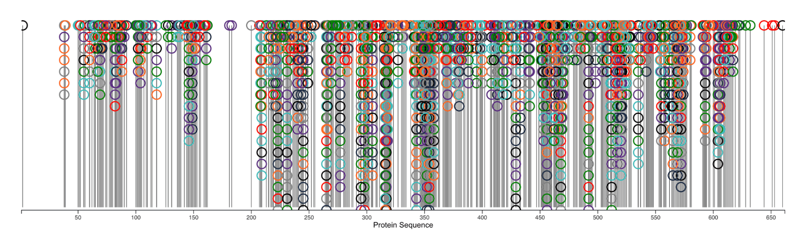

# Visualization Project: Visualizing Protein Residue Modications 

*This project is adapted from the [2022 IEEE Bio+MedVis Challenge: Taming Protein Beasts through Visualization](http://biovis.net/2022/biovisChallenges_vis/)*

## Background 

Proteins are essential biological structures in living organisms that are comprised of residues, i.e., linked amino acids.  During protein synthesis, chemical modifications, such as post-translational modifications, on these residues can impact the protein's structure and function. Such modifications can have positive, negative, or neutral effects on the protein that more broadly can impact the overall fitness of the organism. Understanding the chemical basis of these modifications, as well as **where** and the **frequency** in which they occur, has the potential to help researchers identify and treat rare diseases. Recent efforts to model the occurrence of different chemical modifications across protein sequences have yielded unexpected abundances of modifications at individual residues in a protein sequence that require considered approaches to visualize these data without clutter. 

## Goal 

Redesign the existing visualization, shown in Fig. 1, describing the occurrence and abundance of different chemical modifications in a protein sequence. This visualization is cluttered and uses non-optimal visual encodings for the available screen space and intended user tasks. 

 Fig. 1. *Original visualization of protein residue modifications. The x-axis shows the protein residue site, and the y-axis plots the number of modifications on each site. Circle glyphs indicate individual modifications, and hue identifies each modification type.*

## Dataset 

The data for this project is already cleaned and located in [`./vis-project/src/BioVis-challenge-test-data.csv`](vis-project/src/BioVis-challenge-test-data.csv).

This is a comma-delimited table listing the modification sites for three human proteins (ALDOA, HNRNPA1 and TGFB1) and their mouse orthologs.

* For each site,  the residue, position, and type of modification: note that each site can carry more than one modification, so each site can appear on multiple table rows (1 for each different modification).
* For each modification, the column "classification" indicates if it is an *in vivo* modification, a chemical derivative, an artefact, etc.
* For the 3 human proteins, the column "PathogenicMutation" indicates if the site is mutated in a disease (according to the ClinVar database: https://www.ncbi.nlm.nih.gov/clinvar/). 

Detail of each data attribute:
1. UniAcc
Protein ID in UniProt database (this is just a unique identifier for the protein for a given species, e.g., human)

2. RES
Amino acid residues - there are 20 different amino acids, each have a unique single letter ID

3. POS
The location ID of a given residue in a given protein 

4. MOD
Specific modification that is occurring at that site. 

5. Entry
Similar to UniAcc except more human-readable, identifies the gene+species of protein together as one string

6. Gene
Name of gene that encodes the resulting protein

7. Species
Species that protein comes from, e.g., human, mouse

8. classification
High-level classification of the type of modification that is occurring at the site. This is a more coarse-grained classification relative to MOD attribute

9. PathogenicMutation
Boolean. If True, means that this site is associated with a disease

## Tasks 

Develop a redesigned, interactive visualization using [Vega-Altair](https://altair-viz.github.io/index.html) which enables the user to solve the following tasks:

1. Identify where modifications are most likely to occur, and 
2. Identify and compare the frequencies of different modification types across individual sites. 

Use the **principles of good visualization design** that we discussed on Friday. Because there is a lot of information to show on the screen, consider using interactivity and multiple views of the data to manage information complexity. 

You do **not** need to include all of the data attributes in your visualization. For example, showing mouse vs. human residue modifications is not a requirement to this project. Consider first simply developing a visualization that solves the required tasks for just humans before trying to include the mouse models as a comparison. 

**Required:** Sketch out, with pencil and paper, different options for your visualization designs before you begin any implementation. This will help you work out any issues with your design before you spend (waste?) time developing a solution that will not actually solve the tasks. 
**Strongly recommended**: Use the [Five-Design Sheet Methdology](http://fds.design) to sketch out design options. 